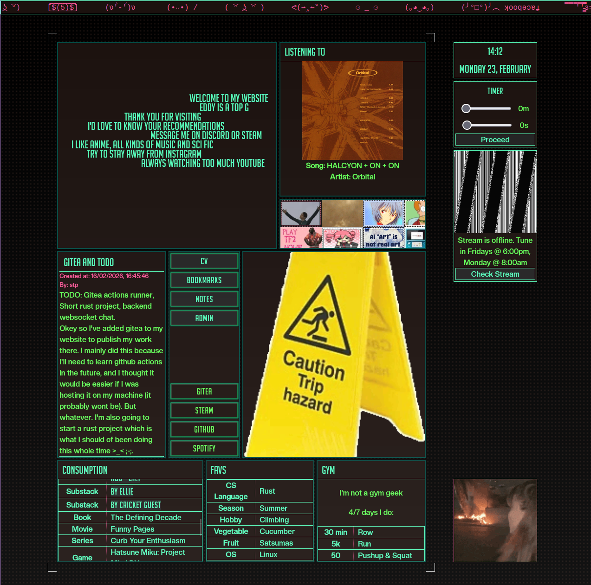

# My Web

## Important TODO

- Get a new background



Welcome to the source code for my website! Please contact me if you would like to collaborate and thank you for visiting.

This website is currently self hosted on my Raspberry Pi. Any interference and the killswitch will activate and stop the UK national grid power system so please don't tamper with my domain :).

## Architecture

All services run in Docker containers orchestrated by Docker Compose:

```
nginx (80, 443) ── Frontend SPA + Reverse Proxy
backend (8080)  ── Go API
db (5432)       ── PostgreSQL 16
icecast2 (8000) ── Audio Streaming
gitea (3000)    ── Self-Hosted Git
gitea-runner    ── CI/CD Runner
certbot         ── SSL Certificate Management
```

## Tech Stack

**Frontend** - Vue 3, Vite, Tailwind CSS, Pinia, Vue Router, markdown-it, Rust/WASM

**Backend** - Go (Gin), GORM, PostgreSQL, JWT auth, WebSockets

**Integrations** - Spotify API, Anthropic Claude API, Icecast2

**Infrastructure** - Docker Compose, Nginx, Let's Encrypt (Certbot), Gitea + Act Runner

## Features

- Spotify integration (currently playing, recently played)
- Obsidian note viewer with wikilink and LaTeX support
- Live radio streaming via Icecast2
- Real-time chat over WebSockets
- Blog with admin panel (CRUD)
- Activity and rowing session tracking
- Fan shrines (GTO, Evangelion, Demoman, Skip Skip Benben)
- Self-hosted Git (Gitea) with CI/CD
- Claude AI integration

## Pages

| Route          | Description                           |
| -------------- | ------------------------------------- |
| `/`            | Home dashboard with grid layout       |
| `/admin`       | Admin panel (authenticated)           |
| `/cv`          | Curriculum Vitae                      |
| `/bookmarks`   | Bookmarks                             |
| `/notes/:path` | Obsidian note viewer                  |
| `/shrines`     | Fan shrine index + individual shrines |

## API

Public endpoints for posts, users, favorites, activities, rowing, Spotify, notes, and WebSocket messaging. Protected endpoints for creating/updating/deleting content require JWT authentication via `/auth/login`.

## Local Testing (Dev Mode)

Run the full stack over plain HTTP without SSL certificates:

```
docker compose -f docker-compose.yml -f docker-compose.dev.yml up --build
```

This uses an HTTP-only nginx config with all routing (SPA, backend proxy, radio, gitea) and disables certbot. Visit `http://localhost` to test.

## Future Ideas

- More Rust to WASM
- ML for chatboards
- Cache requests
- Design more webpages
- Calendar to show radio times
- Nice smooth function background and transitions
- Design shrines
- Redis (not really but practical experience)

## .env

These environment variables are found in the `.env` file. The use of environment variables can be found by reading the code so the security of the variable names are not significant.

```
POSTGRES_USER=
POSTGRES_PASSWORD=
POSTGRES_DB=
POSTGRES_PORT=
POSTGRES_HOST=

GITEA_HOST=
GITEA_PORT=
POSTGRES_GITEA_DB=

GITEA_RUNNER_HOST=
GITEA_RUNNER_NAME=
GITEA_RUNNER_REGISTRATION_TOKEN=

BACKEND_PORT=
BACKEND_HOST=
BACKEND_SECRET=
BACKEND_ENDPOINT=

CLAUDE_API_KEY=

SEED_DB=

OBSIDIAN_DIR=

SPOTIFY_CLIENT_ID=
SPOTIFY_CLIENT_SECRET=
SPOTIFY_REDIRECT_URI=
SPOTIFY_AUTH_STATE=

ICECAST_SOURCE_PASSWORD=
ICECAST_RELAY_PASSWORD=
ICECAST_ADMIN_USER=
ICECAST_ADMIN_PASSWORD=
ICECAST_HOST=
ICECAST_PORT=
ICECAST_MOUNT=

DOMAIN=
EMAIL=

GITEA_LFS_JWT_SECRET=
GITEA_INTERNAL_TOKEN=
GITEA_OAUTH2_JWT_SECRET=
```
